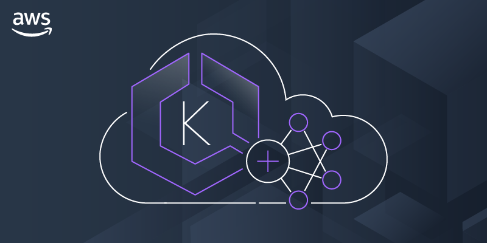

# EMR Containers (i.e. EMR on EKS)

* Using AWS resource for EMR on EKS (i.e. *EMR Containers*), I provide grounded, applicable examples (and explanations) for using this specific service.

Although this service is still somewhat new and not as widely used as the traditional EMR service, it is a powerful tool for those who are already using EKS and want to run Spark jobs on their EKS cluster. At this
points, you can find other examples online but most don't provide a start-to-finish guide on not only how to use this service but build it from nothing (infastructure and policy included).
